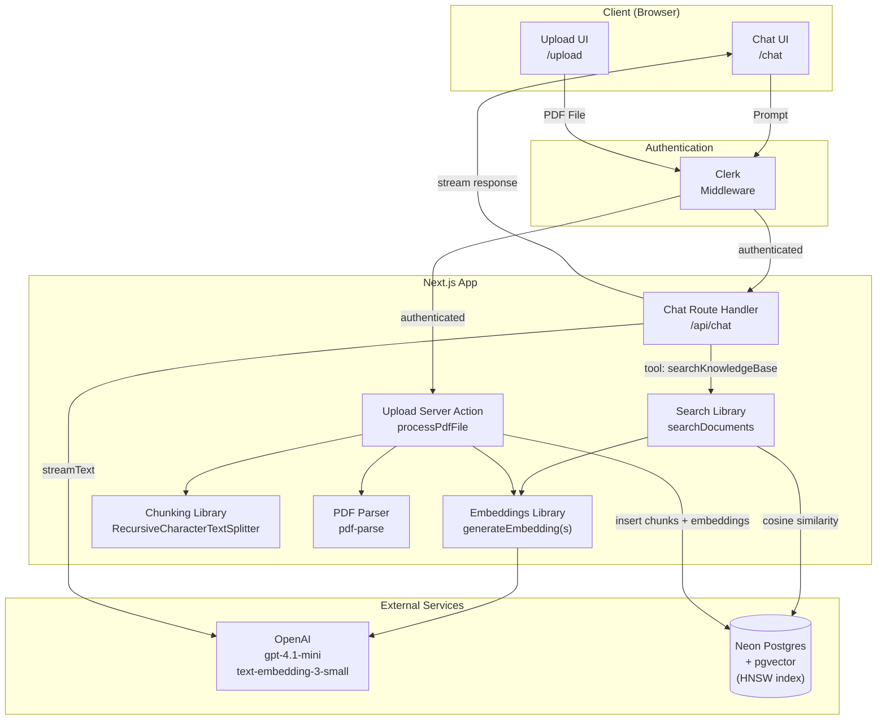
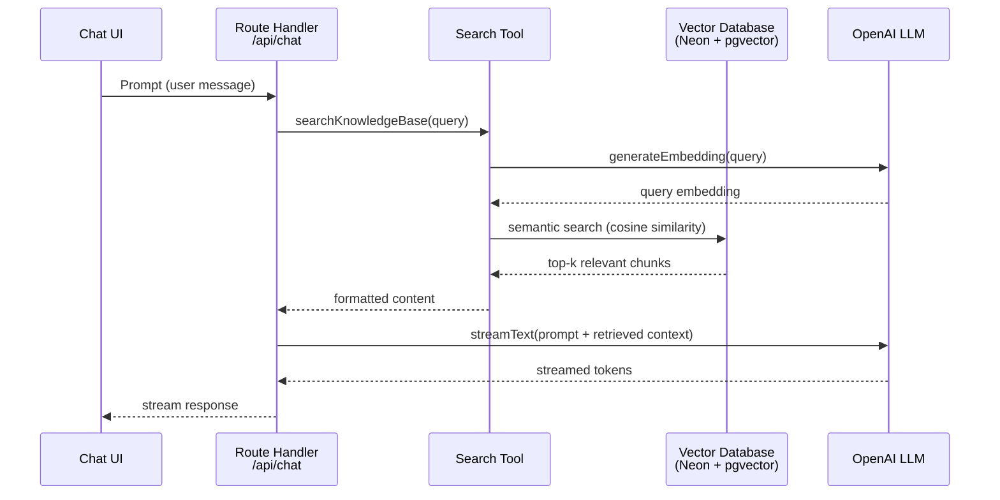
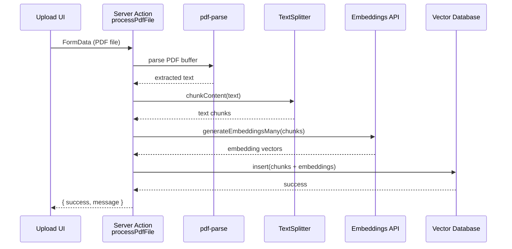
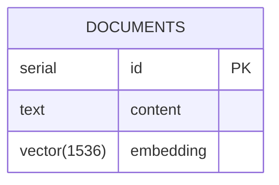

# RAG Chatbot — Architecture

This document describes the architecture and data flow of the RAG (Retrieval Augmented Generation) Chatbot.

## High-Level Overview

The application has two main flows:

1. **Ingestion Flow** — Admin uploads a PDF; text is extracted, chunked, embedded, and stored in a vector database.
2. **Chat Flow** — User asks a question; relevant chunks are retrieved via semantic search and fed to the LLM as context.

---

## System Architecture

---

## RAG Chat Flow (Sequence)

---

## Ingestion Flow (Sequence)

---

## Component Responsibilities

| Layer | File | Responsibility |
|-------|------|----------------|
| Auth | [src/middleware.ts](src/middleware.ts) | Clerk-based route protection |
| Upload UI | [src/app/upload/page.tsx](src/app/upload/page.tsx) | PDF file picker, calls server action |
| Upload Action | [src/app/upload/action.ts](src/app/upload/action.ts) | Parse PDF, chunk, embed, store |
| Chat UI | [src/app/chat/page.tsx](src/app/chat/page.tsx) | Chat interface using `@ai-sdk/react` |
| Chat API | [src/app/api/chat/route.ts](src/app/api/chat/route.ts) | `streamText` with tool calling |
| Search | [src/lib/search.ts](src/lib/search.ts) | Cosine similarity search with threshold + fallback |
| Embeddings | [src/lib/embeddings.ts](src/lib/embeddings.ts) | OpenAI `text-embedding-3-small` |
| Chunking | [src/lib/chunking.ts](src/lib/chunking.ts) | LangChain `RecursiveCharacterTextSplitter` |
| Schema | [src/lib/db-schema.ts](src/lib/db-schema.ts) | Drizzle schema with `vector(1536)` + HNSW index |
| DB Config | [src/lib/db-config.ts](src/lib/db-config.ts) | Drizzle + Neon HTTP driver |

---

## Tech Stack

- **Framework**: Next.js 16 (App Router) + React 19
- **AI SDK**: `ai` v6 + `@ai-sdk/openai`
- **LLM**: OpenAI `gpt-4.1-mini`
- **Embeddings**: OpenAI `text-embedding-3-small` (1536 dimensions)
- **Database**: Neon Postgres + pgvector (HNSW index, cosine distance)
- **ORM**: Drizzle ORM
- **Auth**: Clerk
- **UI**: shadcn/ui + Tailwind CSS v4
- **PDF Parsing**: `pdf-parse` v2
- **Chunking**: `@langchain/textsplitters`

---

## Data Model

- HNSW index on `embedding` using `vector_cosine_ops` for fast approximate nearest neighbor search.

---

## Retrieval Strategy

- **Top-k**: 5 candidates per query
- **Similarity threshold**: 0.35 (cosine similarity)
- **Fallback**: If no chunks meet the threshold, return the top candidates anyway so the LLM still has context to reason with.
